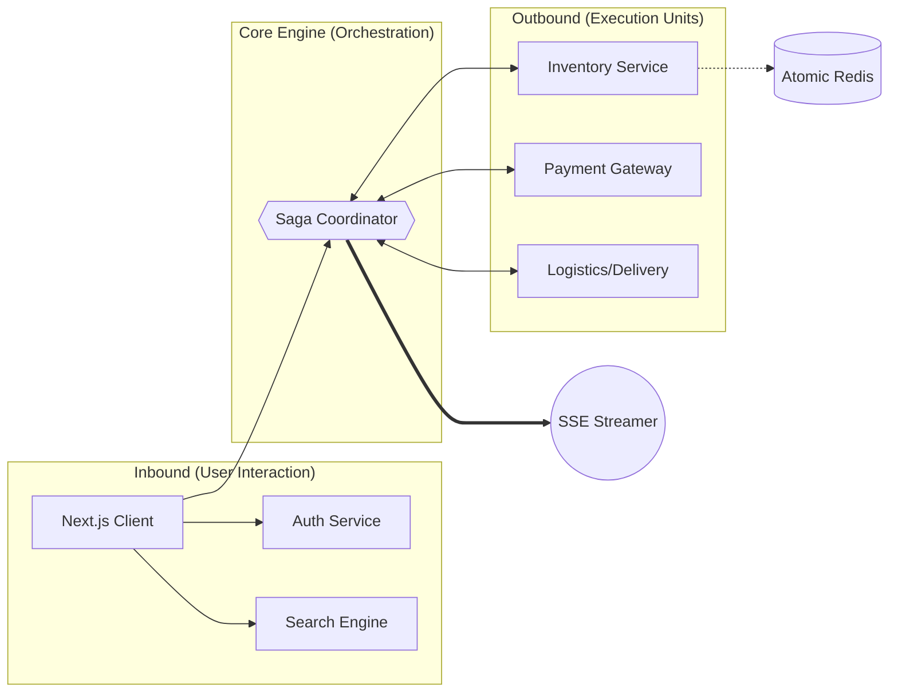
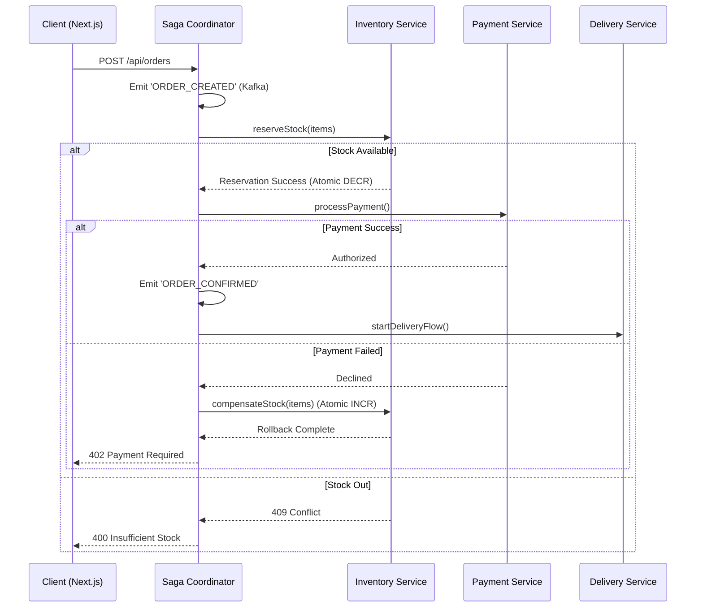
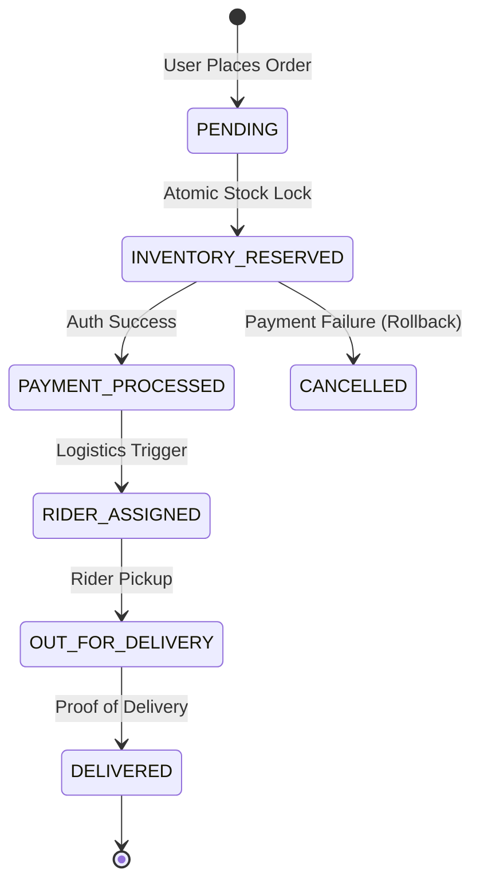

# 10minmarket ⚡ — Hyper-local Delivery Engine

A high-fidelity, production-ready replica of **ultra-fast delivery systems** (inspired by Zepto/Blinkit). This project is a technical deep-dive into **distributed transaction management**, **real-time inventory orchestration**, and **system observability** at scale.

> [!NOTE]
> This system is designed to demonstrate FAANG-level engineering principles, specifically focusing on the **Saga Pattern** for consistency in a distributed environment.

---

##  System Architecture (Butterfly Flow)

The architecture follows a "Butterfly" pattern where the **Saga Coordinator** acts as the central nervous system, balancing inbound request handling with outbound service orchestration.



---

## 🔄 Distributed Saga Orchestration

To maintain data integrity across multiple micro-services without using heavy distributed locks (2PC), we implement an **Orchestration-based Saga Pattern**.

### Order Sequence & Compensation Logic



---

## 🛠️ Technical Terminology

| Terminology | Description |
| :--- | :--- |
| **Saga Pattern** | A failure management pattern that provides eventual consistency by executing a sequence of local transactions with corresponding compensation actions. |
| **Dark Store** | A micro-fulfillment center (MFC) dedicated solely to online fulfillment, strategically located in high-density urban areas for <10min delivery. |
| **LRS (Last-mile Routing)** | The algorithmic optimization of delivery paths from the Dark Store to the user, typically utilizing real-time GPS and traffic data. |
| **Atomic Inventory** | Implementing thread-safe stock operations (DECR/INCR) to prevent race conditions during high-concurrency "flash sale" scenarios. |
| **SSE (Server-Sent Events)** | A unidirectional real-time communication protocol used here to stream backend system logs directly to the "Architecture Observer" UI. |
| **Geofencing** | Virtual perimeters around Dark Stores used to validate delivery eligibility and estimate ETA based on the user's real-time coordinate. |

---

## 📉 Order Lifecycle State Machine



---

## 🚀 Engineering Deep Dive

### 1. Atomic Inventory Management
The system simulates a **Redis-backed inventory** using `ConcurrentHashMap` with synchronized blocks in Java. Every stock adjustment is an atomic operation:
- **`reserve()`**: Performs a check-and-set operation.
- **`restore()`**: Executed during Saga compensation to ensure zero-leakage of stock.

### 2. Real-time Observability (The "Observer" Pattern)
Unlike traditional polling, 10minmarket uses **Server-Sent Events (SSE)**. The backend broadcasts every internal state transition (Kafka topics, service calls, payment pings) to the frontend.
- **Frontend**: A Zustand-managed event buffer.
- **UI**: High-performance Framer Motion logs that animate in real-time as the Saga executes.

### 3. Distributed Tracing
Each order carries a unique `Correlation ID` across the stack, allowing developers to trace a single request from the Next.js `fetch()` call through the Java `SagaCoordinator` and into the mock `DeliveryService` threads.

---

## 🚦 Local Development

### Prerequisites
- Java 21+
- Node.js 18+

### 1. Backend (Spring Boot)
```bash
cd backend
./mvnw spring-boot:run
```

### 2. Frontend (Next.js)
```bash
npm install
npm run dev
```

---

## 👨‍💻 Author
**Saanvi Rajput** — [Portfolio](https://saanvirajput.github.io/saanvirajput-PORTFOLIO/)
